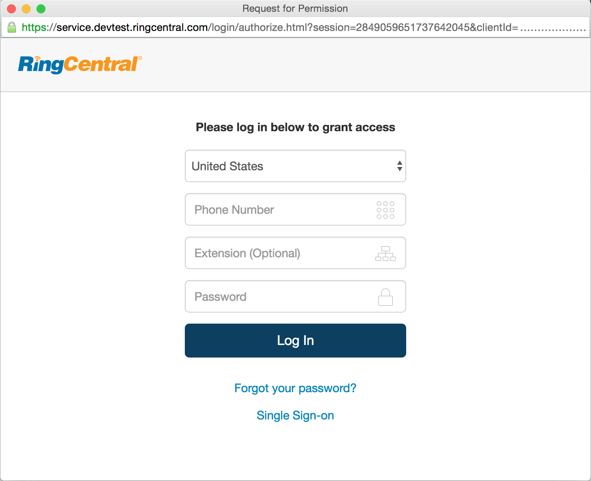
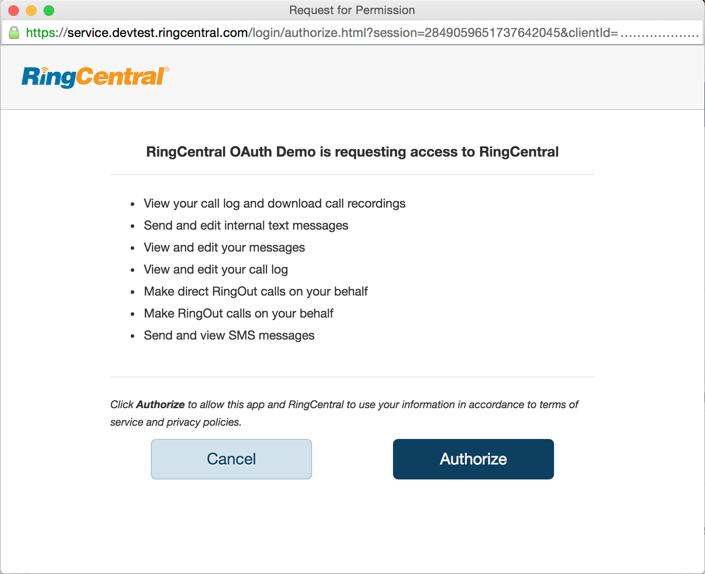

RingCentral OAuth Demos
=======================

This project provides 3-legged OAuth demos using the [OAuth 2.0](https://tools.ietf.org/html/rfc6749) [Authorization Code flow](https://tools.ietf.org/html/rfc6749#section-1.3.1) for the [RingCentral REST API](https://developers.ringcentral.com) in various languages using [official and community SDKs](https://developer.ringcentral.com/library/sdks.html) as described in the [API Developer Guide](https://developer.ringcentral.com/api-docs/latest/index.html#!#AuthorizationCodeFlow).

The authorization code flow is useful for developers because developers have to do less work and the user is presented with a familiar user experience. It accomplishes these goals by redirecting to RingCentral to mange the authentication, authorization, reset password and single sign-on (SSO) flows using a consistent user experience.

The demos use the popup approach for 3-legged OAuth.

Demos are provided for:

* Server-Side Web Apps (more secure)
  * [C# with Nancy](https://github.com/grokify/ringcentral-oauth-demos/tree/master/csharp-nancy)
  * [JavaScript with Express](https://github.com/grokify/ringcentral-oauth-demos/tree/master/javascript-express) (with optional TLS)
  * [PHP](https://github.com/grokify/ringcentral-oauth-demos/tree/master/php)
  * [Python 2.7 with Bottle](https://github.com/grokify/ringcentral-oauth-demos/tree/master/python-bottle)
  * [Ruby with Sinatra](https://github.com/grokify/ringcentral-oauth-demos/tree/master/ruby-sinatra)
* Client-Side Web Apps (less secure)
  * [JavaScript](https://github.com/grokify/ringcentral-oauth-demos/tree/master/javascript)

## Description

From a development perspective, the application needs to make 2 HTTP requests:

1. Request for Authorization Code: The application should open a window that is directed to the RingCentral authorization URL that will present the authentication and authorization flows. Upon completion, the window will redirect to the apps redirect URL (provided in the authorization URL or default if only 1 redirect URL is configured). An optional `state` parameter can be provided for additional security.
2. Request for Access Token: When the window is redirected back successfully, it will include the following query string parameters: `code` for the authorization code and `state` for the state. Assuming the `state` matches, exchange the authorization code for an `access_token` with optional `refresh_token`.

The examples here show both of the two above steps and integrate with existing SDKs where available.

For a step-by-step guide, see the [RingCentral API Developer Guide](https://developer.ringcentral.com/api-docs/) section on [Authorization Code Flow](https://developer.ringcentral.com/api-docs/latest/index.html#!#AuthorizationCodeFlow).

### Server-Side Web Apps

In server-side web app such as PHP, Rails, Django, etc. where the operations occur are slightly different. In these cases, the callback URL should process the callback to retrieve the authorization code and exchange it for an access token.

| Page | Description |
|------|-------------|
| Login page | This is any page with a Login button. This page will open the popup and listen for the redirect, after which it will shut down the popup window. There's no need to do any client-side processing except to shutdown the popup and refresh the page. |
| Callback page | The callback query string will be processed server-side. Nothing is needed client-side. |

### Client-Side Web Apps

Client-side web apps using JavaScript have a feature in that the callback URL does not need to contain any processing either on the client-side or the server-side. The entire flow can be managed by the parent JavaScript page that is initiating the login.

| Page | Description |
|------|-------------|
| Login page | This is any page with a Login button. This page will open the popup and listen for the redirect. For client-side processing, this page will also retrieve the query string parameters from the callback page. |
| Callback page | The minimum requirement is for the page to not be redirected to a URL without the `redirect_uri` since the parent window will poll for the redirect. |

## Screenshots

The following are example screenshots of the authentication and authorization pages shown.

### Authentication

### Authorization

## Links

* Documentation
  * [RingCentral Developer Guide](https://developer.ringcentral.com/api-docs/latest/index.html#!#AuthorizationCodeFlow)
  * [IETF OAuth 2.0 RFC](https://tools.ietf.org/html/rfc6749) [Authorization Code flow](https://tools.ietf.org/html/rfc6749#section-1.3.1)
* SDKs with built-in Authorization Code helpers (others, like Python can still be used)
  * [ringcentral-js](https://github.com/ringcentral/ringcentral-js)
  * [ringcentral-sdk-ruby](https://github.com/grokify/ringcentral-sdk-ruby)
* Example Code
  * [ringcentral-js/demo/oauth](https://github.com/ringcentral/ringcentral-js/tree/5f5197ccb93410d732410127d54449e79ec5c64d/demo/oauth)
  * [ringcentral-oauth-demos](https://github.com/grokify/ringcentral-oauth-demos) - this project
  * [ringcentral-cti-demo-js](https://github.com/ringcentral/ringcentral-cti-demo-js) 

## Contributing

1. Fork it (http://github.com/grokify/ringcentral-demos-oauth/fork)
2. Create your feature branch (`git checkout -b my-new-feature`)
3. Commit your changes (`git commit -am 'Add some feature'`)
4. Push to the branch (`git push origin my-new-feature`)
5. Create new Pull Request
